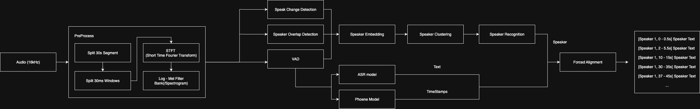

# Who says pipeline

In many real-world speech systems—like smart home assistants, meeting transcribers, or secure voice interfaces—it's crucial not only to transcribe multi-person conversations accurately but also to distinguish who spoke when and to recognize specific users for access control or personalization. This project will build a pipeline that integrates voice activity detection (VAD), speaker diarization, and speaker recognition, enabling systems to selectively trust and process commands from authorized individuals.

The following diagram illustrates the complete pipeline flow, showing how audio input is processed through VAD, speaker diarization, speaker recognition, and ASR components to produce the final transcribed output with speaker labels:



## Set-up, build and run

To use all the models, create a `.env`-file in root based on the existing `example.env`, which should look like this:

```
HF_TOKEN=yourToken
```

You will first need to create a token with read rights on [HuggingFace](https://huggingface.co). Then, to use the models in the WhoSays pipeline, you will also need to manually accept terms for a few of the models. These are:

- [`pyannote/speaker-diarization-3.1`](https://huggingface.co/pyannote/speaker-diarization-3.1),
- [`pyannote/segmentation-3.0`](https://huggingface.co/pyannote/segmentation-3.0),
- [`pyannote/embedding`](https://huggingface.co/pyannote/embedding),
- [`pyannote/separation-ami-1.0`](https://huggingface.co/pyannote/separation-ami-1.0).

Once this is done and the token is set in the `.env`-file, add exectution rights to `run_docker.sh` and run the script:

```bash
chmod +x run_docker.sh
./run_docker.sh
```

This will build a docker image containing the pipeline, backend, and frontend for the website.

Once the pipeline is successfully built, you can access the website in your browser at [localhost:8000](http://localhost:8000).

> **Note:**  
> To get Docker to run you need to have Docker Desktop or simply the Docker process running in the background.

## Compare pipeline models

Run from inside docker (after running `./run.sh start`).

### Compare models with benchmark datasets

**Options:**

- `--component`: Component to compare (`vad` or `sc`)
- `--audio-dir`: Directory containing audio files (required)
- `--annotation-dir`: Directory containing annotation JSON files (required)
- `--language`: Language of dataset (default: `unknown`)
- `--limit`: Limit number of files for quick testing
- `--output-dir`: Output directory (default: `results/comparison/english`)

**VAD Comparison** (Silero vs Pyannote):

```bash
python compare.py --component vad \
    --audio-dir samples/meetings/meeting3-en/chunks \
    --annotation-dir samples/benchmarks/english \
    --language english
```

**Speaker Clustering Comparison**:

```bash
python compare.py --component sc \
    --audio-dir samples/meetings/meeting3-en/chunks \
    --annotation-dir samples/benchmarks/english \
    --language english
```

**ASR Comparison** (7 Whisper models from tiny to large):

```bash
python compare.py --component asr \
    --audio-dir samples/meetings/meeting3-en/chunks \
    --annotation-dir samples/benchmarks/english \
    --language english
```

**E2E (End-to-End) Comparison** (Complete pipeline comparison):

```bash
# Base comparison (WhoSays + Pyannote 3.1)
python compare.py --component e2e \
    --audio-dir samples/meetings/meeting3-en/chunks \
    --annotation-dir samples/benchmarks/english \
    --language english

# Include WhisperX - runs in separate environment component because of conflicting dependencies with the main pipeline (only english version of whisperX is used for now)
python compare.py --component e2e \
    --audio-dir samples/meetings/meeting3-en/chunks \
    --annotation-dir samples/benchmarks/english \
    --language english \
    --include-whisperx
```

**Regenerate E2E plots from existing JSON results:**

If you've made changes to plot styling or want to regenerate plots without re-running the entire comparison (which can take time), you can use the plot regeneration script:

```bash
python e2e_plot_result_from_json.py \
    --json-file results/comparison/english/e2e_comparison_2025-12-19_21-11-41.json

```

### Single file comparison

**VAD:**

```bash
python -m pipeline.speaker_segmentation.VAD.compare_vad_models <audioFile> --annotation <annotationFile>
```

**Speaker embedding and clustering:**

```bash
python -m pipeline.speaker_recognition.embedding.compare_embeddings_clustering <audioFile> --num-speakers 2
```

<!-- Running w/o the script: -->
<!-- Build image -->
<!---->
<!-- ```bash -->
<!-- docker build -t who-says-pipeline . -->
<!-- ``` -->
<!-- ```bash -->
<!-- docker run --rm who-says-pipeline python main.py multi_speaker_sample.mp3 -->
<!-- ``` -->
<!-- To run any module that isn’t at the project root, use the -m flag so Python treats the project as a package. -->
<!-- ```bash -->
<!-- docker run --rm who-says-pipeline python -m pipeline.<component_name>.<library_name>.<etc.> -->
<!-- ``` -->
<!-- This ensures imports (e.g. from `utils/`) work correctly. -->

> **Note:**  
> Every code-containing subfolder (e.g. `pipeline/`, `speaker_recognition/`, `embedding/`, `utils/`, etc.)  
> must include an empty `__init__.py` file so Python recognizes it as a package.

## Adding new pipeline components

1. Create your class in `pipeline/[component]/your_file.py`
2. Export it in `pipeline/[component]/__init__.py`:
   ```python
   from .your_file import YourClass
   __all__ = ["YourClass"]
   ```
3. Import in `main.py`: `from pipeline.[component] import YourClass`
4. Add dependencies to `requirements.txt`
5. Rebuild Docker: `docker build -t who-says-pipeline .`

## Update `requirements.txt`

For now, manually add necessary packages that are not yet installed in the Docker container, i.e.,
add the library (and if needed, the specific version) as a new line in `requirements.txt`.

<!-- We can try this more automated alternative as well, but we need to ensure that it properly includes -->
<!-- the necessary packages (and their version requirements). -->
<!-- Install `pipreqs` -->
<!---->
<!-- ```bash -->
<!-- pip install pipreqs -->
<!-- ``` -->
<!---->
<!-- Use this command to create a new version of `requirements.txt` while in the root directory -->
<!---->
<!-- ```bash -->
<!-- python -m pipreqs.pipreqs . --force -->
<!-- ``` -->
<!---->
<!-- This will override the current `requirements.txt` file with a new one.  -->
